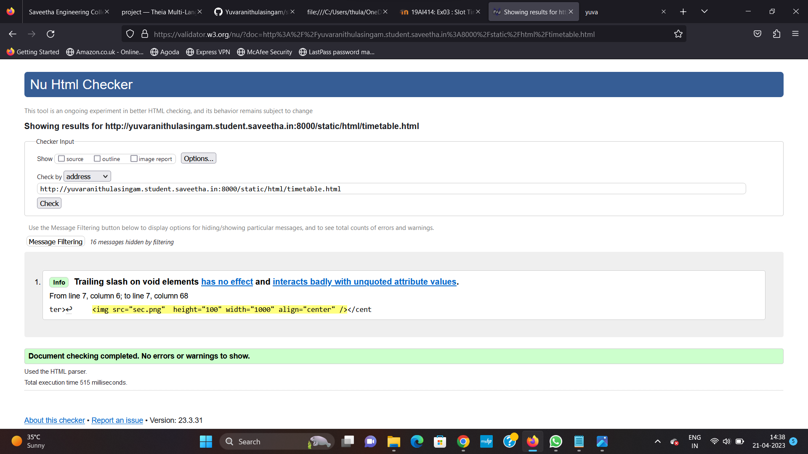

# Ex03 Time Table

## AIM
To write a html webpage page to display your slot timetable.

## ALGORITHM
### STEP 1
Create a Django-admin Interface.

### STEP 2
Create a static folder and inert HTML code.

### STEP 3
Create a simple table using ```<table>``` tag in html.

### STEP 4
Add header row using ```<th>``` tag.

### STEP 5
Add your timetable using ```<td>``` tag.

### STEP 6
Execute the program using runserver command.

## CODE
```
<html>
     <head>
              <title> yuva </title>
     </head>
     <body bgcolor="white" TEXT=" blue">
<center>
     </center>
          
          <table border= "4" cellspacing="0px" cellpadding="10px" bgcolor=green" align="center" >
          <CAPTION align=“top”> SLOT TIME TABLE - YUVARANI T(22009033) </CAPTION>
          <br>
          <br>
               <tr> 
               <th bgcolor="cyan">   DAY/TIME </th>
               <th bgcolor="yellow">   MONDAY </th>
               <th bgcolor="yellow">   TUESDAY </th>
               <th bgcolor="yellow">   WEDNESDAY </th>
               <th bgcolor="yellow">   THURSDAY </th>
               <th bgcolor="yellow">   FRIDAY </th>
               </tr>
               <tr>
                <th bgcolor="yellow"> 8-10 </th>
                <td> -- </td>
                <td> PHYSICS </td>
                <td> -- </td>
                <td> FWAD </td>
                <td> FWAD </td>
               </tr>
               <tr>
                <th bgcolor="yellow"> 10-12 </th>
                <td> -- </td>
                <td> JAPANESE </td>
                <td> PQM </td>
                <td> PQM </td>
                <td> -- </td>
               </tr>
               <tr>
                <th bgcolor="yellow"> 12-1 </th>
                 <td colspan="5" align="center">LUNCH TIME</td>
               </tr>
               <tr>
                <th bgcolor="yellow"> 1-3 </th>
                <td> PrgMC </td>
                <td> -- </td>
                <td> FWAD </td>
                <td> PHYSICS </td>
                <td> -- </td>
               </tr>
               
              
              <tr>
               <th bgcolor="yellow"> 3-5 </th>
               <td> C PROGRAM </td>
               <td> PrgMC </td>
               <td> JAPANESE </td> 
               <td> C PROGRAM </td> 
               <td> -- </td>
              </tr>
           </table>
            <table border= "4" cellspacing="0px" cellpadding="10px"  align="center" >
           <tr>
           <th> S.No </th>
           <th> SUBJECT CODE </th>
           <th> SUBJECT NAME </th>
           </tr>
           <tr> 
           <td> 1. </td>
           <td> 19AI414 </td>
           <td> Fundamental of web application and development </td>
           </tr>
           <tr>
           <td> 2. </td>
           <td> 19EE309 </td>
           <td> Programming microcontroller </td>
           </tr>
           <tr>
           <td> 3. </td>
           <td> 19AI304 </td> 
           <td> Fundamental of C programming </td>
           </tr>
           <tr>
           <td> 4. </td>
           <td> 19PH214 </td>
           <td> Physics for quantum computing </td>
           </tr>
           <tr>
           <td> 5. </td>
           <td> 19EN615 </td>
           <td> Advanced japanese </td>
           </tr>
           <tr>
           <td> 6. </td>
           <td> 19MA222 </td>
           <td> Probability and queueing models </td>
           </tr>
           </table>
              
        </body>
</html>
```

## OUTPUT


## HTML VALIDATOR


## RESULT
The program for creating slot timetable using basic HTML tags is executed successfully.
